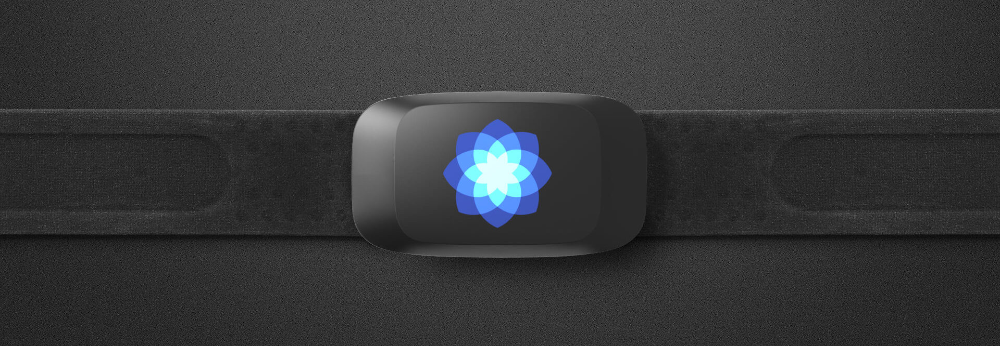

# RespiratoryPatterns

This application connects to a SweetZpot FLOW breathing sensor using Bluetooth
Low Energy, and shows the respiratory rate of the user.

## Requirements

Hardware:

* [SweetZpot FLOW breathing sensor](https://www.sweetzpot.com/flow) ([SweetZpot
  on Facebook](https://www.facebook.com/sweetzpot)).

Software:

* [Web Bluetooth supported browser](https://caniuse.com/#feat=web-bluetooth),
  for example [Google Chrome](https://www.google.com/chrome/).

## Usage

1. Strap the FLOW sensor around your abdomen. The sensor may be worn on top of
   clothing.
2. Open `index.html` in your browser.
3. Click **Connect FLOW**.
4. Wait for the FLOW sensor to appear as "BreathZpot". In some cases this may
   take up to 30 seconds. If it does not appear, this might indicate that the
   FLOW sensor needs a new battery.
5. Select the FLOW (BreathZpot) sensor when it appears, and click **Pair**.
6. After 3-8 seconds, the web app starts receiving data from the sensor, and the
   real time graph of the abdominal movement is shown.
7. The vertical bars shown in the plot are points where the app finds a peak in
   respiration, but this might be inaccurate do to individual variations. Adjust
   the *smoothing* and *peak prominence* to improve accuracy.
8. After 45 seconds, the respiratory rate is calculated from the signal.

### Troubleshooting

If you experience trouble with connecting the sensor, or the web app does not
visualize any data, you could try:

- Reload the page (`index.html`), and try to reconnect to sensor(s).
- Open the JavaScript console in the browser (in Google Chrome: View ->
  Developer -> Javascript Console). Any error messages will appear here.

